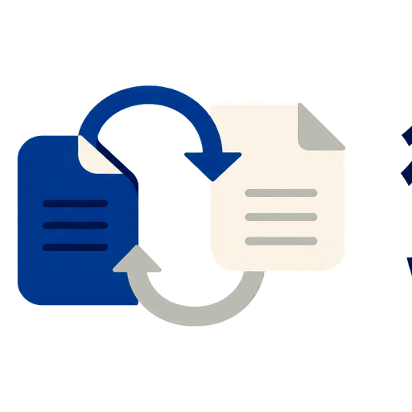

# WeTongbu



WeTongbu saves user-selected WeChat articles, Feishu documents, and article-style web pages to the current Obsidian Vault as Markdown notes with local attachments.

## Features

- Polls WeTongbu tasks and writes Markdown, images, and attachments to the current Vault.
- Free users can use a six-digit binding code to connect the Chrome extension without signing in.
- Pro users authorize the desktop plugin in a browser and can choose local image downloads or stable hosted image links.
- Free uses the user's own Cloudflare R2, Amazon S3, Alibaba Cloud OSS, or Tencent Cloud COS. Pro uses WeTongbu-hosted temporary object storage.
- Temporary task objects are deleted by the service after completion, failure, or expiry. Markdown and attachments remain in the Vault.
- Desktop-only: the plugin needs desktop binary-file support to write attachments into the Vault.

## Getting started

1. Install and enable the plugin.
2. Choose Free storage or sign in for Pro.
3. Free users follow the storage guide, create a private bucket with least-privilege credentials, and select **Test and save**.
4. Free users create a six-digit binding code and enter it in the Chrome extension. This path does not require an account login.
5. Pro users select **Sign in to Pro**, then complete the browser authorization for this desktop plugin.
6. In Chrome, explicitly select a supported document or article and choose **Sync to Obsidian**. Keep Obsidian open until the task completes.

Guides, support, and privacy policy:

- https://wetongbu.com/docs/quick-start/
- https://wetongbu.com/support/
- https://wetongbu.com/privacy/

## Network, accounts, and privacy

The plugin only processes content that the user explicitly chooses to sync, plus task metadata and temporary objects required to complete that sync. It does not read browser history, show advertising, profile users, or include client-side telemetry. Long-lived object-storage keys are never provided to the browser extension. Free credentials are stored in Obsidian SecretStorage and encrypted by the service only for the requested storage workflow.

The plugin calls `api.wetongbu.com` to create or recover a Vault, validate Free object storage, obtain tasks, complete browser-based account authorization, and request deletion of temporary task objects. Task packages and optional Pro hosted images may be transferred through service-issued temporary object-storage or media URLs. The legacy WeChat callback domain is not called by the plugin.

The plugin writes sync output only inside the current Vault. If a task write fails, it moves newly-created files to the Obsidian trash. The optional hosted-image migration reads Markdown notes only under the plugin's configured root folder. Pro requires a WeTongbu account and paid subscription for full hosted features. See the privacy policy above for server-side data handling.

## Development

```bash
npm install
npm run check
npm run build
```

Attach `main.js` and `manifest.json` from the same version to each GitHub Release. The default branch does not commit generated `main.js`.

## 中文说明

微同步把用户主动选择的微信文章、飞书文档和文章型网页保存到当前 Obsidian Vault，并生成 Markdown 与本地附件。

- Free 用户不登录也可通过六位绑定码连接 Chrome 扩展，并使用自己的 R2、S3、OSS 或 COS。
- Pro 用户在浏览器中明确授权桌面插件，可选图片下载到本地，或保存到微同步云端并以稳定链接写入笔记。
- 对象存储只承担临时任务中转；任务完成、失败或过期后由服务端清理，最终 Markdown 和附件保留在 Vault。
- 插件只处理用户主动同步的内容。网络请求、账号、付费能力和数据处理说明见上方英文说明与隐私政策。

## Support

Use https://wetongbu.com/support/ for support. Do not send access keys, secret keys, verification codes, recovery codes, or complete presigned URLs in support requests.
